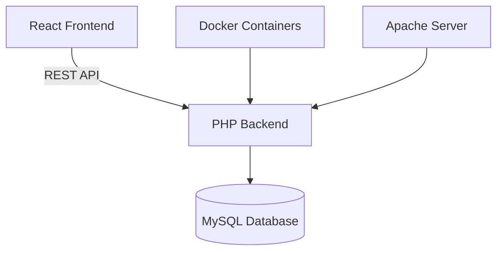
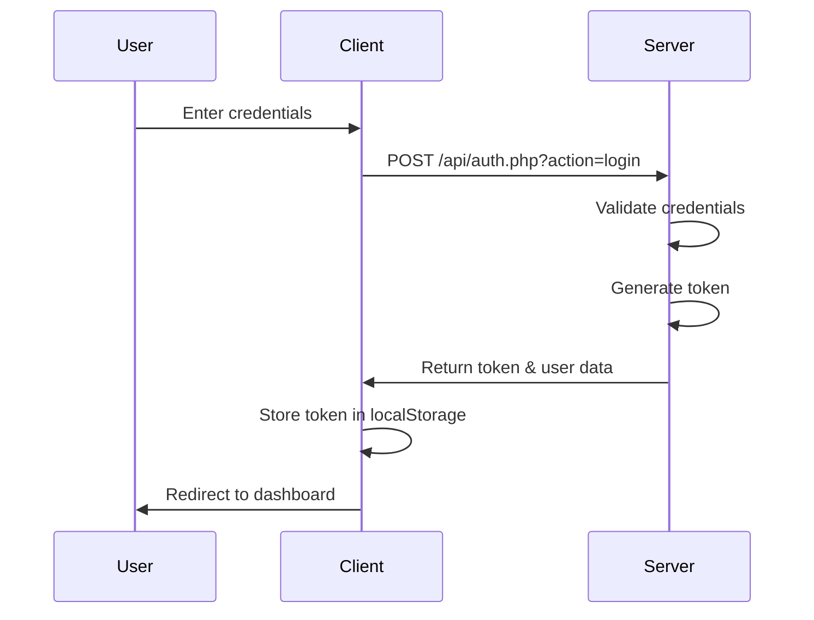
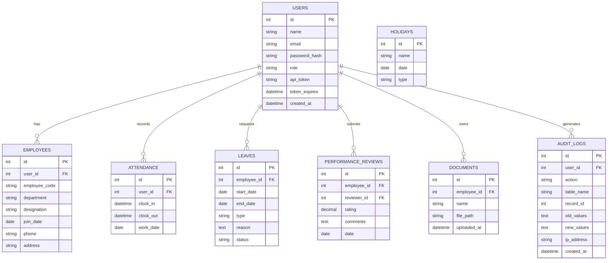
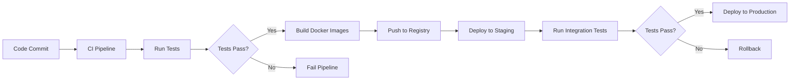

# Employee Management System (EMS) - Technical Documentation

## 📘 Project Overview

The Employee Management System (EMS) is a comprehensive web application designed to streamline HR operations and employee management. Built with modern technologies, it offers features such as employee tracking, attendance management, leave requests, performance evaluation, and document management.

### Primary Features
- **User Authentication & Authorization** - Secure login with role-based access control
- **Employee Management** - CRUD operations for employee records
- **Attendance Tracking** - Clock in/out functionality with shift management
- **Leave Management** - Request, approve, and track leave applications
- **Performance Evaluation** - Submit and view performance reviews
- **Document Management** - Upload and manage employee documents
- **Holiday Calendar** - Manage company holidays and events

### Target Users
- **Administrators** - Full access to all system features
- **HR Managers** - Manage employees, attendance, and leave requests
- **Employees** - View personal information, clock in/out, and request leave

## 🏗️ System Architecture

The EMS follows a client-server architecture with a React frontend and PHP backend:



### Architecture Components
1. **Frontend** - React.js application with responsive UI components
2. **Backend** - PHP API server with MySQL database
3. **Database** - MySQL relational database for data persistence
4. **Authentication** - JWT-like token-based authentication system
5. **Deployment** - Docker containers for easy deployment

## 🧠 Technology Stack

### Frontend
| Technology | Version | Purpose |
|------------|---------|---------|
| React.js | 18.2.0 | UI Library |
| React Router | 6.26.2 | Client-side routing |
| Axios | 1.12.2 | HTTP client |
| Bootstrap | 5.3.3 | UI components |
| Sass | 1.93.2 | CSS preprocessing |
| Recharts | 3.2.1 | Data visualization |
| Framer Motion | 12.23.24 | Animations |

### Backend
| Technology | Version | Purpose |
|------------|---------|---------|
| PHP | 8.1+ | Server-side language |
| MySQL | 8.0 | Database |
| Apache | 2.4+ | Web server |
| PDO | - | Database abstraction |

### Development & Testing
| Tool | Purpose |
|------|---------|
| Jest | Frontend unit testing |
| PHPUnit | Backend testing |
| Docker | Containerization |
| npm | Package management |
| Git | Version control |

### DevOps
| Tool | Purpose |
|------|---------|
| Docker Compose | Multi-container orchestration |
| Nginx | Production web server |
| Node.js | Build tooling |

## 🗃️ Directory Structure

```
ems/
├── api/                    # Backend API
│   ├── classes/           # Model classes
│   ├── config/            # Configuration files
│   ├── includes/          # Utility functions
│   └── *.php             # API endpoints
├── client/                # Frontend application
│   ├── public/           # Static assets
│   ├── src/              # Source code
│   │   ├── components/   # Reusable UI components
│   │   ├── context/      # React context providers
│   │   ├── pages/        # Page components
│   │   ├── services/     # API service layer
│   │   └── styles/       # SCSS stylesheets
│   └── package.json      # Frontend dependencies
├── data/                 # Database files
├── docs/                 # Documentation
├── server/               # Server configuration
├── testsprite_tests/     # End-to-end tests
├── util/                 # Utility scripts
├── docker-compose.yml    # Docker configuration
├── README.md             # Project README
└── Documentation.md      # This file
```

## 🔐 Authentication & Authorization

The system implements a token-based authentication mechanism with role-based access control.

### Authentication Flow



### Roles & Permissions
1. **Admin** - Full access to all features
2. **HR** - Manage employees, attendance, and leave requests
3. **Employee** - Limited access to personal features

## 🧩 Core Features

| Feature | Description | APIs Used |
|---------|-------------|-----------|
| User Authentication | Login/logout functionality | `/api/auth.php` |
| Employee Management | CRUD operations for employees | `/api/employees.php` |
| Attendance Tracking | Clock in/out with shift management | `/api/attendance.php` |
| Leave Management | Request and approve leave applications | `/api/leaves.php` |
| Performance Reviews | Submit and view performance evaluations | `/api/performance.php` |
| Document Management | Upload and manage employee documents | `/api/documents.php` |
| Holiday Management | Manage company holidays | `/api/holidays.php` |
| Statistics Dashboard | View system metrics and reports | `/api/stats.php` |

## ⚙️ Backend Architecture

### Key Routes

| Route | Method | Description | Authentication |
|-------|--------|-------------|----------------|
| `/api/auth.php` | POST | User authentication | Optional |
| `/api/employees.php` | GET/POST/PUT/DELETE | Employee management | Required |
| `/api/attendance.php` | GET/POST/PUT/DELETE | Attendance tracking | Required |
| `/api/leaves.php` | GET/POST/PUT/DELETE | Leave management | Required |
| `/api/performance.php` | GET/POST/PUT/DELETE | Performance reviews | Required |
| `/api/documents.php` | GET/POST/PUT/DELETE | Document management | Required |
| `/api/holidays.php` | GET/POST/PUT/DELETE | Holiday management | Required |
| `/api/stats.php` | GET | System statistics | Required |

### Example API Endpoints

#### Login
```bash
POST /api/auth.php?action=login
Content-Type: application/json

{
  "email": "admin@ems.com",
  "password": "admin123"
}
```

#### Get All Employees
```bash
GET /api/employees.php
Authorization: Bearer <token>
```

#### Clock In
```bash
POST /api/attendance.php
Authorization: Bearer <token>
Content-Type: application/json

{
  "action": "clockIn"
}
```

### Database Schema



## 🖥️ Frontend Architecture

### Component Hierarchy

```
App
├── AuthProvider
│   └── Router
│       ├── Login
│       ├── Dashboard
│       ├── Employee Management
│       ├── Attendance
│       ├── Leave Management
│       ├── Performance Evaluation
│       ├── Document Management
│       └── Holiday Calendar
├── Navbar
├── Sidebar
└── ToastContainer
```

### Key Components

| Component | Purpose |
|-----------|---------|
| `AuthProvider` | Manages authentication state |
| `Navbar` | Top navigation bar |
| `Sidebar` | Side navigation menu |
| `EmployeeForm` | Employee creation/editing form |
| `Pagination` | Paginated data display |
| `ToastContainer` | Notification system |

### Routing Structure

```javascript
<Route path="/login" element={<Login />} />
<Route path="/dashboard" element={<Dashboard />} />
<Route path="/employees" element={<EmployeeManagement />} />
<Route path="/attendance" element={<MyAttendance />} />
<Route path="/admin/attendance" element={<AdminAttendance />} />
<Route path="/leaves" element={<ApplyLeave />} />
<Route path="/admin/leaves" element={<LeaveManagement />} />
<Route path="/performance" element={<PerformanceEvaluation />} />
<Route path="/documents" element={<DocumentManagement />} />
<Route path="/holidays" element={<HolidayCalendar />} />
```

## 🧪 Testing & Quality Assurance

### Test Structure

```
ems/
├── client/
│   └── src/
│       ├── __tests__/           # Unit tests
│       └── pages/
│           └── __tests__/       # Integration tests
├── api/
│   └── tests/                   # Backend tests
└── testsprite_tests/            # End-to-end tests
```

### Testing Commands

#### Frontend Testing
```bash
# Run all frontend tests
cd client
npm test

# Run tests with coverage
npm test -- --coverage

# Run tests in watch mode
npm test -- --watch
```

#### Backend Testing
```bash
# Run backend tests
cd api
phpunit
```

#### End-to-End Testing
```bash
# Run E2E tests
python testsprite_tests/TC001_login_with_valid_credentials.py
python testsprite_tests/TC002_login_with_invalid_credentials.py
```

### Test Coverage
- Unit tests for critical components
- Integration tests for API endpoints
- End-to-end tests for user flows
- Automated testing in CI/CD pipeline

## 🚀 Deployment Guide

### Environment Requirements
- PHP 8.1+
- MySQL 8.0+
- Apache 2.4+ or Nginx
- Node.js 18+ (for frontend build)
- Docker (optional, for containerized deployment)

### Deployment Steps

#### Manual Deployment
1. Clone the repository:
```bash
git clone https://github.com/Napx96/mini-project.git
cd ems
```

2. Set up the database:
```sql
CREATE DATABASE ems_db;
-- Import schema if available
```

3. Configure the backend:
```bash
# Update database configuration in api/config/database.php
```

4. Install frontend dependencies:
```bash
cd client
npm install
```

5. Build the frontend:
```bash
npm run build
```

6. Deploy to web server:
- Copy backend files to web root
- Copy built frontend files to web root
- Configure web server (Apache/Nginx)

#### Docker Deployment
```bash
# Build and run with Docker Compose
docker-compose up -d

# Access the application:
# Frontend: http://localhost
# Backend API: http://localhost:8080/ems/api/
```

### CI/CD Pipeline



## 🧱 Workspace Organization

### Folder Conventions
- `api/` - Backend API endpoints and models
- `client/` - Frontend React application
- `docs/` - Project documentation
- `tests/` - Automated tests
- `util/` - Utility scripts and tools

### Contributing Guidelines
1. Fork the repository
2. Create a feature branch
3. Make changes and commit
4. Run tests to ensure nothing breaks
5. Push to your fork
6. Create a pull request

### Code Standards
- Follow existing code patterns
- Use consistent naming conventions
- Write clear comments for complex logic
- Maintain proper indentation
- Write unit tests for new features

## 📈 Future Enhancements

### Short-term Improvements
1. **Enhanced Reporting** - Advanced analytics and reporting features
2. **Mobile Optimization** - Responsive design improvements
3. **Notification System** - Real-time notifications for leave approvals
4. **Performance Optimization** - Database query optimization

### Long-term Roadmap
1. **Microservices Architecture** - Break monolith into microservices
2. **Real-time Features** - WebSocket integration for live updates
3. **AI Integration** - Predictive analytics for employee performance
4. **Multi-language Support** - Internationalization (i18n)
5. **Mobile Application** - Native mobile apps for iOS and Android

### Scalability Plans
1. **Load Balancing** - Implement load balancer for high availability
2. **Database Sharding** - Horizontal partitioning for large datasets
3. **Caching Layer** - Redis/Memcached for improved performance
4. **CDN Integration** - Content delivery network for static assets

## 🪪 Author & Credits

**Project**: Employee Management System (EMS)
**Author**: Senior Technical Documentation Writer & Full-Stack Web Architect
**Date**: November 2025

### Contributors
- Development Team
- QA Engineers
- UI/UX Designers
- DevOps Engineers

### Acknowledgements
- Open-source libraries and frameworks
- Testing tools and platforms
- Documentation tools